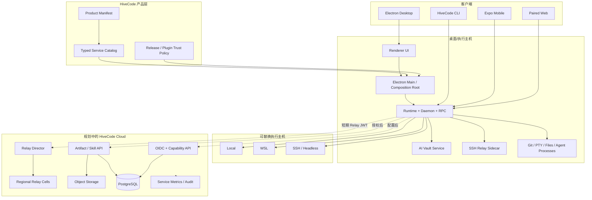

# HiveCode 产品、架构与开发路线总设计

> 文档状态：权威（Authoritative）
> 最后更新：2026-08-23
> 适用范围：桌面端、CLI、移动端、配对式 Web、远程运行时、Skills、Artifacts、HiveCode Cloud 与发布体系

## 1. 文档权威与维护规则

本文是 HiveCode 唯一的产品总设计文档，统一回答以下问题：

- 当前真正实现并可用的功能是什么；
- 哪些能力只有代码和界面、但被产品配置关闭；
- 产品边界、总体架构、功能行为和安全不变量是什么；
- 下一阶段按什么依赖顺序开发，何时才算完成。

状态词只有四种：

| 状态           | 含义                                                        |
| -------------- | ----------------------------------------------------------- |
| **已启用**     | HiveCode 默认配置下可用，具备代码与回归测试证据             |
| **条件可用**   | 已实现，但依赖平台、用户配置、实验开关或手动入口            |
| **接线但关闭** | 客户端、协议或 UI 已存在，HiveCode 产品配置主动 fail-closed |
| **规划**       | 尚未形成可交付的 HiveCode 产品能力                          |

本文维护产品目标、跨模块架构、功能语义、路线和发布门槛。窄范围协议、安全模型、运维步骤和平台兼容矩阵继续放在 `docs/reference/`；它们是本文引用的实现约束，不是另一版产品设计。不得新建带 `plan`、`checklist`、`findings`、`draft`、`final`、`revised`、`new`、`copy` 或版本号后缀的平行设计文档。一次性实施过程进入 issue、milestone 或 CI artifact，完成后不留在仓库中充当现状说明。

## 2. 产品定位与原则

HiveCode 是一个以本地优先、远程等价和多智能体并行为核心的开发工作台。它把工作区、终端、代码审查、浏览器、移动客户端和多种编码 Agent 放在同一个可恢复会话模型中，而不是替代 Git、Shell、SSH、Agent CLI 或用户选择的云厂商。

长期原则：

1. **本地优先，云端增强。** 无账号时，桌面工作台、CLI、本地/WSL/SSH 工作区、局域网配对和本地 Skills 仍应工作。
2. **执行主机拥有执行。** 文件、Git、PTY、进程和 Agent 生命周期由实际执行主机持有；断联只表示 `unverifiable`，不表示进程已退出。
3. **产品配置是唯一外部服务入口。** 正式包不得回退到 Orca 的登录、Relay、下载、遥测或市场端点。
4. **客户端可独立升级。** 桌面、移动、Web 与远程 runtime 的协议变化必须保持向后兼容，或通过 capability negotiation 显式协商。
5. **最小权限与明确同意。** Agent 账号与 HiveCode Cloud 身份分离；遥测、诊断、发布和分享分别授权。
6. **上游兼容是持续成本。** 产品差异进入产品层和 composition root；通用能力尽量保持为可上游合并的注入点。

非目标：自建模型供应商、托管用户的 Codex/Claude 凭据、把短暂断网等同于进程死亡、把用户 VM/provider/billing 包装为 HiveCode 自营服务、用云端功能阻断本地开发主链路。

## 3. 当前能力基线

事实判定以 `config/product/hivecode.product.json`、生成配置、默认 feature flags、composition root 和测试为准。README、历史计划和上游发布 workflow 不能单独证明 HiveCode 已上线某项能力。

### 3.1 默认可用能力

| 领域             | 当前能力                                                                                                               | 状态与边界                                                      |
| ---------------- | ---------------------------------------------------------------------------------------------------------------------- | --------------------------------------------------------------- |
| 桌面工作台       | folder workspace 与 Git worktree、并行工作区、终端、编辑/预览、分屏、SCM/Checks、任务、自动化、设置、Mobile 入口       | **已启用**；主视图由 `AppWorkspaceShell` 与共享 view types 驱动 |
| Agent 会话       | 多种 CLI Agent、会话状态、账号切换、用量、恢复、通知、Agent Teams/编排接口                                             | **已启用**；具体 Agent 能力仍取决于用户安装和登录               |
| 终端             | 多 pane/split、PTY 流、链接打开、TUI 输入、持久化与重连                                                                | **已启用**；本地、WSL、SSH 必须保持相同行为语义                 |
| 代码与审查       | 文件编辑/预览、Git diff、AI diff 标注、提交、Checks、PR/review 流程                                                    | **已启用**；provider 通用概念不能硬编码为 GitHub-only           |
| 浏览器与设计     | 内置浏览器、Design Mode、远程浏览器流、Computer Use 接口                                                               | **已启用/条件可用**；Computer Use 受平台权限和原生组件约束      |
| GitHub 与 Linear | issue、PR、项目和任务上下文进入工作区                                                                                  | **已启用**；依赖用户自己的 provider 凭据与 CLI                  |
| CLI              | `hivecode` 主命令、`orca-ide` 兼容别名、open/serve/status、worktree、terminal、browser、orchestration、skills 等命令组 | **已启用**；Linux 不安装冲突的裸 `orca` bin                     |
| 远程执行         | SSH host/workspace、WSL runtime、直接 runtime 配对、Tailscale/反代/SSH forward、headless server                        | **已启用/条件可用**；执行权始终属于远端主机                     |
| 配对式 Web       | 可构建 Web 客户端，通过 runtime RPC 复用工作台 UI                                                                      | **条件可用**；必须连接用户可达的 runtime，不是公共 SaaS IDE     |
| 移动客户端       | Expo 客户端、扫码/配对、主机、终端、Tasks、文件、SCM、Review、账号、历史、通知与诊断                                   | **已启用/条件可用**；源码与本地构建可用，官方商店分发尚未建立   |
| 本地 Skills      | 发现、安装、更新、卸载、事务恢复、provider placement、远程 runtime 安装                                                | **条件可用**；页面默认隐藏，可通过设置/CLI 使用                 |
| AI Vault         | 标题、首个 prompt、子 Agent 和扫描工作移出桌面主进程；SSH relay 带 sidecar                                             | **已启用**；保留兼容回退和既有 IPC/RPC                          |

### 3.2 已实现但产品关闭的能力

| 领域                  | 已存在的实现                                                                | 当前关闭原因                                                          |
| --------------------- | --------------------------------------------------------------------------- | --------------------------------------------------------------------- |
| HiveCode Cloud/Auth   | OIDC/PKCE 客户端、refresh/revoke、组织与 capability、profile 绑定           | `cloud` 与 `relay` endpoint 均为空；正式包不读取开发覆盖              |
| Anywhere/Relay        | director、relay transport、E2EE link、恢复、迁移、token rotation 客户端逻辑 | 产品 `relay` endpoint 为空，无 HiveCode 托管服务                      |
| Artifacts             | 页面、预览、CLI CRUD/share、云客户端与分享策略                              | 分享开关关闭且 `artifacts` endpoint 为空                              |
| Skill Sharing         | bundle、签名/哈希、事务安装、远程安装、cloud upload/share/grant 客户端      | 分享开关关闭且 HiveCode Cloud 未部署；历史 Orca production 记录不适用 |
| Plugins/Marketplace   | 插件运行时、市场和 kill-list 客户端                                         | `pluginSystemEnabled=false`，市场端点为空，官方信任仍含上游命名空间   |
| 自动更新              | feed、签名/来源/重定向/大小边界和 updater UI                                | publisher、provider、channel、repository、update endpoint 全为空      |
| Telemetry/Diagnostics | 事件、consent 状态、transport、诊断与反馈客户端                             | endpoint 与隐私政策为空；现有首次提示不满足明确 opt-in 要求           |
| 公共分发              | Windows/macOS/Linux/Android/iOS 本地构建脚本                                | 无 HiveCode 发布权限、签名上传链、下载地址、商店渠道和公共站点        |
| 实验功能              | Activity/Agents、Pet、Native Chat、hibernation、新卡片、Ephemeral VM 等     | 默认实验开关关闭；不能写入对外功能承诺                                |

### 3.3 明确不存在的产品能力

- HiveCode 官方账号云、组织后台、托管 Relay、Artifact/Skill 后端；
- 可公开访问的 Web IDE 或公共 runtime；
- HiveCode 官方插件市场和独立的“官方插件”信任命名空间；
- 已配置的桌面自动更新源、公开下载页、Android/iOS 商店渠道；
- HiveCode 托管 VM/provider/account/billing；
- 已获得明确同意且有隐私政策支撑的产品遥测。

## 4. 总体架构

### 4.1 分层职责

| 层                                | 职责                                                          | 禁止事项                                             |
| --------------------------------- | ------------------------------------------------------------- | ---------------------------------------------------- |
| Product manifest/generated config | 产品身份、公共链接、服务端点、发布渠道                        | 代码内散落生产默认 URL                               |
| Product adapters                  | 把产品配置转换为 updater、cloud、artifact、telemetry 等窄接口 | 上游核心直接依赖 HiveCode 品牌或仓库                 |
| Composition root                  | 选择实现、注入依赖、根据 capability 注册服务                  | 功能模块自行发现隐藏的生产 fallback                  |
| Renderer                          | 呈现状态和用户意图，不持有执行真相                            | 根据 socket/UI 消失推断远程进程退出                  |
| Runtime/daemon/relay              | 工作区、PTY、Agent、RPC、流和恢复的执行权威                   | 把远程文件或进程静默回退到本机执行                   |
| AI Vault service                  | 有界扫描、标题/摘要派生和独立故障域                           | 阻塞主进程或无限排队                                 |
| Cloud data/control plane          | 身份/capability、Relay 路由、包元数据与对象                   | 保存 Agent refresh token、明文 prompt、terminal 内容 |

### 4.2 配置与依赖方向

推荐依赖方向为：

`product manifest → generated config → typed service catalog → composition root → feature port`。

上游核心通过构造参数或窄 port 获得配置，不能反向 import `src/main/product/`。Cloud 配置必须拆成可独立部署的 `IdentityConfig`、可选 `RelayConfig`、`PackageConfig` 与独立 `UpdaterConfig`；当前 Auth 因缺 Relay 被整体判定未配置的耦合必须在云端开发前解除。

### 4.3 进程与故障边界

- Renderer 只消费事件和快照；高频流通过有界聚合发布，不能在组件树中形成无界订阅 fanout。
- Runtime/daemon 持有会话、PTY 和工作区状态；Electron window 退出或重载不应自动杀死仍受管的任务。
- AI Vault 默认使用惰性监督子进程，队列上限 16、内存目标上限 384 MiB、连续三次故障开启 circuit breaker；桌面兼容开关 `ORCA_AI_VAULT_SERVICE_PROCESS=0` 仅用于回退。
- Renderer 的 AI Vault 结果先读缓存，在输入静默 100 ms 后发布，最长等待 1 秒，并使用 React transition 降低输入竞争。
- SSH relay bundle 必须携带 AI Vault sidecar；远程版本不支持时保持原 RPC 兼容路径，不能把远端扫描移回本机。

### 4.4 数据、身份与信任边界

- Agent provider 凭据与 HiveCode Cloud OIDC session 分库存储、分开刷新、分开退出。
- device token、refresh token 和私钥使用平台安全存储；日志、遥测和错误消息不得包含 token。
- Relay 仅使用短期、限 audience/scope 的 Relay JWT；E2EE 密钥不由 relay 解密。
- Artifact 与 Skill 可以共享 API origin 和对象存储基础设施，但必须分路由、命名空间、配额、保留策略和 kill switch。
- Updater 不依赖登录、Relay 或 capability；安装包信任来自签名、发布源、哈希和受限网络边界。
- Marketplace 不允许索引自授“官方”身份；官方发布者、仓库/commit、内容哈希、签名和 kill list 由 HiveCode 产品 trust policy 决定。
- Telemetry 不使用 Cloud 用户身份；Diagnostics 是用户主动上传的独立通道。

## 5. 功能设计

### 5.1 工作区、Worktree 与远程主机

统一实体是 workspace，不假设它一定是 Git worktree。创建入口可来自目录、repository、issue/PR、SSH host、WSL 或已配对 runtime。每个 workspace 记录 execution host、repo/folder identity、worktree lineage、活动 pane 与恢复信息。

目标行为：

- 本地、WSL、SSH 与 folder workspace 共享同一 UI 和状态词；
- Git 能力以实际执行主机为缓存作用域，核心流程兼容 Git 2.25；
- SSH 失联产生 `unverifiable`，重连后由远端事实恢复；
- 删除、停止、扫描和打开文件均路由到 execution host；
- worktree 扫描以 Git admin fingerprint 控制刷新成本，显式变更仍立即失效缓存。

### 5.2 Agent、终端与编排

Agent 本质上是受管终端会话，外加 provider metadata、状态推断、通知和编排关系。终端 split、Agent team pane、普通 shell 和任务进程共享会话生命周期，但不得共享错误的“socket 断开即退出”假设。

关键语义：

- 支持多 Agent 并行和不同 provider；产品不接管 provider 登录；
- pane 的 live/unverifiable/exited 判定来自执行主机；
- Agent 状态更新按事件顺序聚合，避免高频事件阻塞 Renderer；
- 命令、文件和图片拖入 Agent 前保持用户可见的目标与权限；
- automations 默认由用户工作区和凭据执行，云端只在未来提供调度增强，不能成为唯一执行路径。

### 5.3 编辑、源码管理、Review 与外部任务

编辑器、Markdown/二进制预览、SCM、Checks、diff annotation、GitHub/Linear 页面共享当前 workspace 和 execution host。通用 review 类型保持 provider-neutral；GitHub 特性置于显式 provider 分支，GitLab 等 provider 不被 GitHub 命名污染。

发布验收至少覆盖：打开/编辑/保存、提交、diff、文件链接、PR/issue 建工作区、SSH/WSL 上的同等操作、不同 Git 版本的优选命令与 fallback。

### 5.4 Browser、Design Mode 与 Computer Use

Browser pane 负责页面浏览、远程浏览器流和 Design Mode 上下文；Computer Use 是受权限保护的自动化入口。移动/Web 不能直接复用桌面原生权限时，应显示 unavailable/capability 状态，不得伪造成功。

### 5.5 Mobile 与配对式 Web

Mobile 和 Web 都是 runtime 客户端，不是新的执行权威。直接 LAN/Tailscale/SSH-forward 配对保持本地优先；Cloud Relay 上线后只扩展可达性。

移动交互不变量：

- 首次聚焦一个 terminal handle 时默认直接输入；用户可显式切换 buffered 模式；切换 session 不自动弹出键盘；
- WebView 未 ready 时输出入有界队列，ready 后按序 replay；订阅恢复必须重新建立 PTY stream；
- foreground/network handoff 触发 half-open 探测和物理 client 替换，不复用已失活的单次 connect promise；
- 已有数据在预期的迁移/重连阶段保持可见，以 `connecting/reconnecting` 覆盖层代替灰屏；
- relay 迁移优先 make-before-break，并记录 pairing/transport 阶段但不记录密钥；
- deep link/resume 目标在进入 host stack 前经 catalog 校验；找不到时回到可恢复列表，而不是循环跳转。

协议规则以 `docs/reference/remote-wire-compatibility.md` 为准：已有 JSON frame 可加 optional 字段，新 stream opcode 必须协商；host 发布内容的语义变化也必须进行旧客户端测试。

### 5.6 Skills 与 Artifacts

本地 Skills 的规范路径是：发现 → 预览/准入 → 有界解包 → 加锁 → 原子安装 canonical copy → provider placement → provenance → 验证/恢复。远程安装在目标 execution host 完成，客户端只传递已验证的 bundle 和用户意图。

Cloud 分享上线后：

- Artifact 是通用对象分享；Skill 是带 manifest、provider placement 和安装事务的包，不把两者混成一个权限模型；
- upload/finalize、download grant、share/revoke/delete 均幂等，并可从响应丢失中恢复；
- archive 拒绝路径穿越、链接逃逸、超限文件/尺寸和不允许的类型；
- 公开、未列出、组织内和私有语义由服务端授权，不由 URL 难猜性代替；
- mixed-version runtime 通过 `skills.install.bundle.v1` 等 capability 协商；
- UI 只有在 endpoint、用户授权和 capability 同时成立时显示发布动作。

详细稳定约束继续由以下窄文档维护：Skill threat model、upstream boundary、provider paths、用户分享指南和管理员手册。历史部署 run ID、完成清单和 Orca Cloud production 状态不进入 HiveCode 设计。

### 5.7 Release、Updater 与公共分发

Release 是其余云功能的前置安全能力。目标支持 `rc` 与 `stable` 两条独立 feed，桌面端按签名身份和产品 channel 选择更新；Windows/macOS/Linux 使用各平台签名，Android/iOS 使用独立移动发布链。

必须满足：

- 正式包只访问 manifest 声明的更新源，拒绝跨源初始请求；
- redirect/CDN 授权精确、短期，清除不安全 header，限制 metadata 与 artifact 大小；
- 版本、channel、publisher、签名、文件名和公开下载地址一致；
- Windows silent update 真实安装测试覆盖 daemon/session 生存与无窗口闪现；
- 更新失败可回滚或保留当前可启动版本；更新不要求 Cloud 登录；
- HiveCode 仓库自己的 CI、证书、release 权限和上传目标生效后，才可称“官方发布体系”。

### 5.8 HiveCode Cloud、Relay 与可观测性

目标服务分为：

1. **Identity/Capability API**：OIDC Authorization Code + PKCE、session exchange、refresh/revoke、组织和 capability；
2. **Relay Director/Cells**：区域选择、短期 token、连接租约、drain/rebind、E2EE 数据转发；
3. **Package API**：Artifact/Skill 元数据、upload finalize、授权 download grant、share 生命周期；
4. **对象与元数据存储**：对象存储保存密文/包，PostgreSQL 保存授权、版本、审计和幂等键；
5. **服务端可观测性**：从第一阶段提供 SLO、错误率、容量、审计和告警，不等于产品遥测。

产品 Telemetry 最后启用。启用前必须具备隐私政策、事件目录、保留/删除策略、显式 opt-in 和端到端零请求测试；不得采集路径、prompt、terminal 内容、token 或 Cloud user id。Diagnostics 维持用户主动触发、预览和脱敏。

## 6. 非功能要求与发布门槛

### 6.1 安全与隐私

- 正式包在所有 endpoint 为空时必须产生零产品外部请求；
- 不得出现 `login.onorca.dev`、`relay.onorca.dev` 等生产 fallback；
- OIDC 校验 PKCE/state/nonce，refresh/revoke 处理竞态并使用安全存储；
- host key 变更 fail-closed，后台重连不弹出欺骗性信任提示；
- plugin、skill、artifact、updater 各自有签名/哈希/来源/撤销策略；
- 日志和事件通过集中脱敏规则，不记录凭据、用户内容和 share URL。

### 6.2 兼容性

- 保留 `orca`/`orca-ide`、`orca://`、`ORCA_*` 和旧 `.orca` 路径作为兼容面，不用于新产品营销；
- desktop、mobile、web、relay 与上一稳定版做 mixed-version 测试；
- RPC 增量字段 optional，新 opcode capability-negotiated；
- 支持 folder workspace、本地/WSL/SSH、Windows/macOS/Linux；
- Linux native binary 保持 Ubuntu 20.04 / glibc 2.31 floor；Windows 子进程统一经过受控 spawn 边界。

### 6.3 性能与可靠性

- 输入、PTY 输出和 Agent 状态高频路径有明确延迟/内存预算和基准；
- 队列必须有上限、deadline、backoff、取消和丢弃策略；
- 断线恢复、进程崩溃、更新、机器睡眠、foreground/background 和网络切换均有可重复测试；
- 服务端以 auth、relay、package API 分别定义 SLO、容量和故障域。

### 6.4 每阶段统一质量门

1. lint、typecheck、单元/集成测试通过；
2. 相关 Windows/macOS/Linux、mobile/web、SSH/WSL 测试通过；
3. 品牌边界、产品配置、文档治理和 fork-delta 审计通过；
4. endpoint egress、日志脱敏、安全负例和上一稳定版兼容测试通过；
5. 文档中的功能状态与默认配置一致；
6. 上游核心差异文件数不因产品配置扩张，确需扩张时有明确 ADR 和回收计划。

## 7. 开发路线

路线按依赖顺序推进，不按已有 UI 的显眼程度推进。

| 阶段                   | 优先级 | 交付内容                                                                                        | 退出条件                                                                                  |
| ---------------------- | ------ | ----------------------------------------------------------------------------------------------- | ----------------------------------------------------------------------------------------- |
| 0. 架构与事实收口      | P0     | 本文档、文档治理、typed service catalog 方案、Auth/Relay 配置解耦、产品 adapter 注入边界        | endpoints 全空零外联；无上游生产 fallback；核心模块不直接依赖产品层                       |
| 1. Release/Updater     | P0     | HiveCode 自有 RC/Stable release、签名、桌面 feed、Windows 安装包、Android 发布链、下载/法律链接 | 三桌面平台发布验证；Windows 更新 E2E；Android CI 产物可追溯；回滚演练完成                 |
| 2. Identity/Capability | P0     | 自有域名、OIDC/PKCE、session、组织、capability、terms/privacy                                   | packaged build 忽略 dev override；安全存储与 refresh/sign-out race 通过；零 Orca 服务流量 |
| 3A. Relay              | P0/P1  | director、首个区域 cell、短期 JWT、E2EE、rotation、drain/rebind                                 | desktop/mobile mixed-version、网络切换、故障/负载演练、日志零凭据                         |
| 3B. Artifacts          | P1     | API、对象存储、元数据、CRUD/share、配额、保留/删除                                              | 幂等与丢响应恢复；分享授权、过期、删除和内容脱敏通过                                      |
| 4. Skill Sharing       | P1     | 复用现有 bundle/事务安装，连接 HiveCode Package API                                             | Native Windows/WSL/macOS/Linux/SSH/paired runtime 全矩阵；撤销、回滚、恶意包测试通过      |
| 5. Plugin Marketplace  | P1     | HiveCode trust namespace、官方源、审核、权限 consent、kill list                                 | 官方身份不可自授；commit/hash/signature 固定；离线 kill-list 策略和恶意插件隔离通过       |
| 6. Product Telemetry   | P2     | 自有 collector、事件治理、显式同意、保留/删除                                                   | opt-in 前零请求；隐私政策生效；敏感字段负例和服务端删除审计通过                           |
| 7. 多区域与团队增强    | P2     | Relay 多区域、组织级策略、团队分享/管理、容量治理                                               | 跨区切换和灾备演练；租户隔离、审计、成本与容量预算达标                                    |

阶段 3A 与 3B 可在 Identity 稳定后并行；Marketplace 的 trust policy 可提前实现，但不能在信任、kill list 和隔离测试完成前对外启用。产品 Telemetry 不阻塞服务端可观测性。

## 8. 决策记录

| 决策             | 结论                                 | 拒绝方案                                                |
| ---------------- | ------------------------------------ | ------------------------------------------------------- |
| 云端所有权       | 只接入 HiveCode 自有或明确受控的服务 | 正式包回退 Orca Cloud；会导致品牌、隐私、SLA 和权限失控 |
| 首个线上闭环     | Release/Updater 先于 Cloud 分享      | 先开放显眼的分享 UI；缺少安全发布和回滚能力             |
| Auth/Relay       | 配置和部署解耦                       | 要求 cloud+relay 同时存在；阻塞渐进交付                 |
| Artifact/Skill   | 共享基础设施、分离领域策略           | 用一个 share 模型覆盖所有对象；权限和生命周期不同       |
| Marketplace 信任 | 产品 trust anchor 决定官方身份       | marketplace index 自报 official；可被供应链伪造         |
| 产品遥测         | 明确 opt-in，最后启用                | 关闭提示即静默 opt-in；不满足当前产品隐私要求           |
| 设计文档         | 单一总设计 + 窄 reference            | 每功能保留 plan/checklist/findings 多份现状             |

## 9. 相关稳定规范

本文不复制以下窄规范的详细步骤；修改相关模块时必须同时遵守：

- `docs/engineering/fork-boundary-policy.md`：产品所有权、同步分支和 denylist；
- `docs/STYLEGUIDE.md`：UI token、组件和交互视觉规则；
- `docs/reference/remote-wire-compatibility.md`：跨版本 RPC/stream 规则；
- `docs/reference/ssh-execution-boundary.md`、`ssh-host-key-verification.md`：远程执行与主机信任；
- `docs/reference/git-compatibility.md`、`wsl-command-execution.md`、`windows-setup-shell.md`、`windows-process-enumeration.md`、`linux-glibc-compatibility.md`：平台兼容；
- `docs/reference/agent-skill-sharing-threat-model.md`、`agent-skill-sharing-upstream-boundary.md`、`agent-skill-provider-paths.md`：Skill 安全与落点；
- `docs/reference/relay-regional-placement.md`：Relay 区域选择；
- `mobile/README.md`：移动开发、配对和调试命令。

## 10. 已合并资料处置

以下历史资料的稳定结论已经进入本文，不再作为平行版本保留：

| 历史资料                                                   | 归并位置                                       |
| ---------------------------------------------------------- | ---------------------------------------------- |
| Skill sharing installation plan / implementation checklist | 5.6、6、7 与既有 Skill reference 文档          |
| AI Vault process isolation plan                            | 4.3、6.3                                       |
| Mobile relay UX、issue #5049、terminal streaming findings  | 5.5、6.3                                       |
| Mobile terminal direct-input design                        | 5.5 与 `mobile/README.md` 的开发行为摘要       |
| SSH config host picker E2E plan                            | 现有 E2E spec 作为可执行规范                   |
| Fork delta baseline                                        | `pnpm run audit:fork-delta` 的按需 CI artifact |
| Mobile homepage/tasks HTML mocks                           | 已实现 UI 与测试，不保留孤立原型               |

后续路线状态直接更新本文的“当前能力基线”和“开发路线”，不创建 `v2`、`新版`、`最终版` 或新 checklist。
