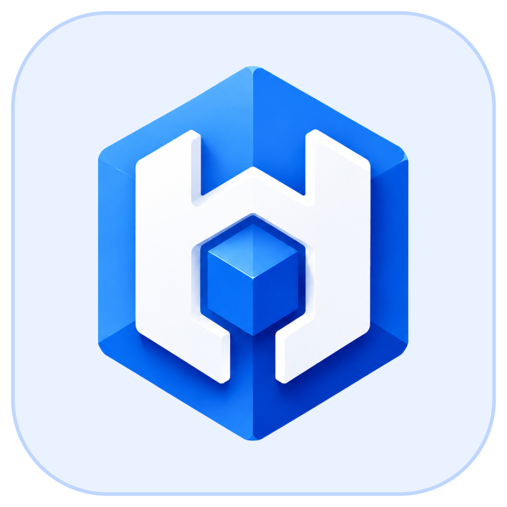

<h1 align="center">
   HiveCode
</h1>

<p align="center">
  
  
</p>

<p align="center">
  <sub><a href="../../README.md">English</a> · <a href="README.zh-CN.md">中文</a> · <a href="README.ko.md">한국어</a> · <a href="README.es.md">Español</a> · <a href="README.fr.md">Français</a> · <a href="README.pt.md">Português</a></sub>
</p>

<p align="center">
  <strong>100x ビルダーのための AI オーケストレーター。</strong><br/>
  Codex、Claude Code、OpenCode、Pi を並べて実行 — それぞれを専用のワークツリーで動かし、1 か所で追跡できます。
</p>

> [!IMPORTANT]
> HiveCode は現在エンジニアリング fork であり、承認済みの公開ダウンロード、更新、クラウド、サポート、コミュニティのエンドポイントはありません。以下の機能リンクとスクリーンショットは互換性の参考として upstream Orca から引き継いだもので、HiveCode のリリースリンクではありません。

<p align="center">
  
</p>

## 機能

<table>
<tr>
<td width="50%" valign="middle">

### モバイル Companion

スマートフォンからエージェントを監視・操作 — エージェントの完了を通知で受け取り、どこからでもフォローアップを送信できます。

[upstream Orca モバイル互換性ドキュメント →](https://www.onorca.dev/docs/mobile)

</td>
<td width="50%">
  <a href="https://www.onorca.dev/docs/mobile"><picture><source srcset="../assets/feature-wall/mobile-companion-app-showcase.gif" type="image/gif"></picture></a>
</td>
</tr>
<tr>
<td width="50%" valign="middle">

### 並列ワークツリー

1 つのプロンプトを 5 つのエージェントに展開し、それぞれを独立した git ワークツリーで実行 — 結果を比較して、最良のものをマージできます。

[ドキュメント →](https://www.onorca.dev/docs/model/worktrees)

</td>
<td width="50%">
  <a href="https://www.onorca.dev/docs/model/worktrees"><picture><source srcset="../assets/feature-wall/parallel-worktrees.gif" type="image/gif"></picture></a>
</td>
</tr>
<tr>
<td width="50%" valign="middle">

### ターミナル分割

WebGL レンダリング、無制限の分割、再起動後も残るスクロールバックを備えた Ghostty クラスのターミナル。

[ドキュメント →](https://www.onorca.dev/docs/terminal)

</td>
<td width="50%">
  <a href="https://www.onorca.dev/docs/terminal"><picture><source srcset="../assets/feature-wall/terminal-splits.gif" type="image/gif"></picture></a>
</td>
</tr>
<tr>
<td width="50%" valign="middle">

### デザインモード

実際の Chromium ウィンドウで任意の UI 要素をクリックすると、その HTML、CSS、切り抜いたスクリーンショットがそのままエージェントのプロンプトに送られます。

[ドキュメント →](https://www.onorca.dev/docs/browser/design-mode)

</td>
<td width="50%">
  <a href="https://www.onorca.dev/docs/browser/design-mode"><picture><source srcset="../assets/feature-wall/design-mode.gif" type="image/gif"></picture></a>
</td>
</tr>
<tr>
<td width="50%" valign="middle">

### GitHub &amp; Linear をネイティブに

PR、Issue、プロジェクトボードをアプリ内で閲覧 — 任意のタスクからワークツリーを開き、コンテキストスイッチなしでレビューできます。

[ドキュメント →](https://www.onorca.dev/docs/review/linear)

</td>
<td width="50%">
  <a href="https://www.onorca.dev/docs/review/linear"><picture><source srcset="../assets/feature-wall/github-linear.gif" type="image/gif"></picture></a>
</td>
</tr>
<tr>
<td width="50%" valign="middle">

### SSH ワークツリー

強力なリモートマシン上でエージェントを実行 — ファイル編集、git、ターミナルをフルに使え、自動再接続とポートフォワーディングも付属します。

[ドキュメント →](https://www.onorca.dev/docs/ssh)

</td>
<td width="50%">
  <a href="https://www.onorca.dev/docs/ssh"><picture><source srcset="../assets/feature-wall/ssh-worktrees.gif" type="image/gif"></picture></a>
</td>
</tr>
<tr>
<td width="50%" valign="middle">

### AI Diff に注釈

任意の Diff 行にコメントを付けてエージェントへ送り返せます — HiveCode から離れずにレビュー、編集、コミットまで完結します。

[ドキュメント →](https://www.onorca.dev/docs/review/annotate-ai-diff)

</td>
<td width="50%">
  <a href="https://www.onorca.dev/docs/review/annotate-ai-diff"><picture><source srcset="../assets/feature-wall/annotate-diff.gif" type="image/gif"></picture></a>
</td>
</tr>
<tr>
<td width="50%" valign="middle">

### ファイルをエージェントへドラッグ

オートセーブが全面的に効く VS Code のエディタ — ファイルや画像をそのままエージェントのプロンプトへドラッグできます。

[ドキュメント →](https://www.onorca.dev/docs/editing/file-explorer)

</td>
<td width="50%">
  <a href="https://www.onorca.dev/docs/editing/file-explorer"><picture><source srcset="../assets/feature-wall/file-drag.gif" type="image/gif"></picture></a>
</td>
</tr>
<tr>
<td width="50%" valign="middle">

### HiveCode CLI

エージェント自身も HiveCode を操作できます — `hivecode worktree create`、`snapshot`、`click`、`fill` であらゆるワークフローをスクリプト化できます。

[ドキュメント →](https://www.onorca.dev/docs/cli/overview)

</td>
<td width="50%">
  <a href="https://www.onorca.dev/docs/cli/overview"><picture><source srcset="../assets/feature-wall/orca-cli.gif" type="image/gif"></picture></a>
</td>
</tr>
</table>

**さらに同梱:**

- **[クイックオープン](https://www.onorca.dev/docs/model/quick-open)** — フローを離れずに、ワークツリー、ファイル、エージェント、コマンド、リポジトリコンテキストを横断検索できます。
- **[アカウント切り替えと使用量トラッキング](https://www.onorca.dev/docs/agents/usage-tracking)** — Claude と Codex の使用量やレート制限のリセットを確認し、再ログインなしでアカウントを切り替えられます。
- **[リッチなリポジトリプレビュー](https://www.onorca.dev/docs/editing/markdown)** — Markdown、画像、PDF、リポジトリ文書をワークスペース内でプレビューできます。
- **[Computer Use](https://www.onorca.dev/docs/cli/computer-use)** — 実際の操作が必要なワークフローでは、エージェントにデスクトップアプリや画面上の UI を操作させられます。
- **[通知と未読ステータス](https://www.onorca.dev/docs/notifications)** — エージェントの完了や要対応をすぐに把握し、スレッドを未読に戻して後で確認できます。

---

## 対応するエージェント

**あらゆる CLI エージェント**で動作します — ターミナルで動くものなら、HiveCode でも動きます。

<p>
  <a href="https://docs.anthropic.com/claude/docs/claude-code"><kbd> Claude Code</kbd></a> &nbsp;
  <a href="https://github.com/openai/codex"><kbd> Codex</kbd></a> &nbsp;
  <a href="https://x.ai/cli"><kbd> Grok</kbd></a> &nbsp;
  <a href="https://cursor.com/cli"><kbd> Cursor</kbd></a> &nbsp;
  <a href="https://docs.github.com/en/copilot/how-tos/set-up/install-copilot-cli"><kbd> GitHub Copilot</kbd></a> &nbsp;
  <a href="https://opencode.ai/docs/cli/"><kbd> OpenCode</kbd></a> &nbsp;
  <a href="https://ampcode.com/manual#install"><kbd> Amp</kbd></a> &nbsp;
  <a href="https://openclaude.gitlawb.com/"><kbd> OpenClaude</kbd></a> &nbsp;
  <a href="https://antigravity.google/docs/cli-overview"><kbd> Antigravity</kbd></a> &nbsp;
  <a href="https://pi.dev"><kbd> Pi</kbd></a> &nbsp;
  <a href="https://omp.sh"><kbd> oh-my-pi</kbd></a> &nbsp;
  <a href="https://hermes-agent.nousresearch.com/docs/"><kbd> Hermes Agent</kbd></a> &nbsp;
  <a href="https://block.github.io/goose/docs/quickstart/"><kbd> Goose</kbd></a> &nbsp;
  <a href="https://docs.augmentcode.com/cli/overview"><kbd> Auggie</kbd></a> &nbsp;
  <a href="https://github.com/autohandai/code-cli"><kbd> Autohand Code</kbd></a> &nbsp;
  <a href="https://github.com/charmbracelet/crush"><kbd> Charm</kbd></a> &nbsp;
  <a href="https://docs.cline.bot/cline-cli/overview"><kbd> Cline</kbd></a> &nbsp;
  <a href="https://www.codebuff.com/docs/help/quick-start"><kbd> Codebuff</kbd></a> &nbsp;
  <a href="https://commandcode.ai/docs/quickstart"><kbd> Command Code</kbd></a> &nbsp;
  <a href="https://docs.continue.dev/guides/cli"><kbd> Continue</kbd></a> &nbsp;
  <a href="https://docs.factory.ai/cli/getting-started/quickstart"><kbd> Droid</kbd></a> &nbsp;
  <a href="https://kilo.ai/docs/cli"><kbd> Kilocode</kbd></a> &nbsp;
  <a href="https://www.kimi.com/code/docs/en/kimi-code-cli/getting-started.html"><kbd> Kimi</kbd></a> &nbsp;
  <a href="https://kiro.dev/docs/cli/"><kbd> Kiro</kbd></a> &nbsp;
  <a href="https://github.com/mistralai/mistral-vibe"><kbd> Mistral Vibe</kbd></a> &nbsp;
  <a href="https://github.com/QwenLM/qwen-code"><kbd> Qwen Code</kbd></a> &nbsp;
  <a href="https://support.atlassian.com/rovo/docs/install-and-run-rovo-dev-cli-on-your-device/"><kbd> Rovo Dev</kbd></a> &nbsp;
  <kbd>+ any CLI agent</kbd>
</p>

---

## インストール

HiveCode は現在、承認済みのデスクトップ版またはモバイル版バイナリを公開していません。upstream Orca の release、App Store、TestFlight、Homebrew、AUR、APK リンクを HiveCode のインストール手順として使用しないでください。

ローカル開発：

```bash
pnpm install
pnpm dev
pnpm typecheck
pnpm test
```

デスクトップアプリは `pnpm run build:desktop` でビルドします。ネイティブビルドはプラットフォーム固有です。対応する `config/scripts/` のスクリプトを参照してください。

## 互換性

既存のインストールや永続化データを壊さないため、`orca`、`orca-ide`、`orca://`、`ORCA_*`、従来の `.orca` ディレクトリ、upstream プラグイン ID は保持されます。これらは互換性のための識別子であり、HiveCode の製品ブランドではありません。

## 開発について

コントリビューションと upstream 同期の境界は[コントリビューションガイド](../../.github/CONTRIBUTING.md)を参照してください。

## 帰属とライセンス

HiveCode は Stably AI のオープンソース [Orca](https://github.com/stablyai/orca) プロジェクトを基盤とし、[MIT ライセンス](../../LICENSE)で提供されます。
